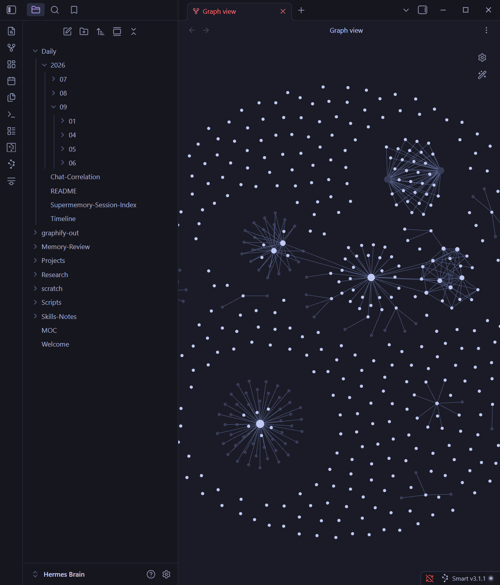
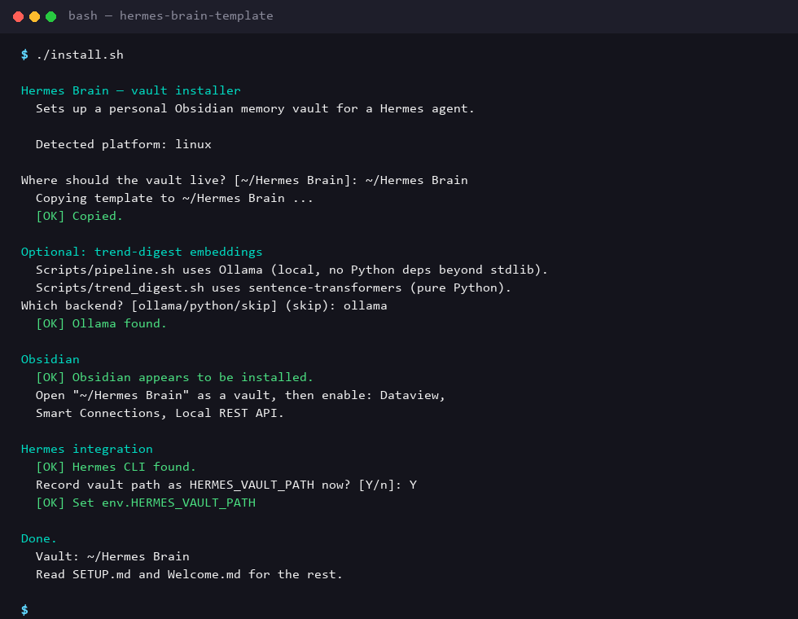

# Hermes Brain — Obsidian Vault Template for Hermes Agent (including OpenClaw)

[](LICENSE)
[](https://obsidian.md)
[](https://claude-code.nousresearch.com/docs)
[](https://claude-code.nousresearch.com/docs)
[](https://github.com/mistrysiddh/hermes-brain-template/actions/workflows/lint.yml)
[](CHANGELOG.md)

**Give your Hermes/OpenClaw agent a memory it can't forget — and you can actually read.**

Every session your agent runs gets archived as plain markdown, deduped and
secret-scrubbed automatically, and staged for you to review before anything
becomes permanent. No black box, no vendor lock-in — it's just an Obsidian
vault, so you can search it, link it, graph it, and back it up like any
other notes.



## Why this instead of nothing?

- **You stop losing context.** Every Hermes session gets archived automatically — nothing lives only in a chat log you'll never scroll back to.
- **You stay in control of what becomes "memory."** Nothing gets promoted to Hermes's real memory without a human reading and approving it first.
- **It's just markdown.** Open it in Obsidian, `grep` it, put it in git, read it in Notepad — no proprietary format, no export step.
- **Set up once, in one paste.** A single prompt into your Hermes chat installs the vault *and* wires up hourly archiving — see below.

## Why this instead of [alternative]?

| | Hermes Brain | Raw chat logs | Vector-DB memory (e.g. Mem0) | Generic Obsidian PKM |
|---|---|---|---|---|
| **Human review before "memory"** | ✅ staged in `Memory-Review/`, nothing auto-promotes | ❌ nothing structured | ❌ auto-embedded, opaque | N/A — no agent pipeline |
| **Readable without special tooling** | ✅ plain markdown | ✅ but unstructured | ❌ needs the vendor's UI/API | ✅ |
| **Portable / no vendor lock-in** | ✅ your files, your git repo | ✅ | ❌ tied to the service | ✅ |
| **Built-in agent-usage analytics** | ✅ token usage, vault audit, agent performance — all in `Dashboard.md` | ❌ | Varies | ❌ |
| **Zero setup for a Hermes agent specifically** | ✅ one-paste install prompt | N/A | ❌ separate integration work | ❌ generic, no agent wiring |

Use a vector-DB memory service if you want the agent to auto-recall
semantically similar things with zero human-in-the-loop. Use this
template if you want to **see and approve** what your agent remembers,
in a format you already own.

## What's inside

```
Daily/YYYY/MM/DD/*.md   →   Memory-Review/*.md   →   Hermes native MEMORY.md / USER.md
 (raw session archive)      (staged candidate         (durable, injected every
                              facts, human-reviewed)    turn — promoted by hand)
```

- **`Daily/`** — every Hermes session exported as redacted markdown, one file per session, organized by date, with a live [[Daily/Timeline|Timeline]] and [[Daily/Chat-Correlation|Chat-Correlation]] Dataview view.
- **`Memory-Review/`** — durable-fact candidates staged for human review before promotion, with an automated dedupe/secret-scrub pass (`consolidate_memory.py`).
- **`Research/`** — working space for in-progress investigation, plus optional local-embedding "trend digest" scripts.
- **`Skills-Notes/`** — index of installed Hermes skills, a team-profiles index, a generated `Skill-to-Chat-Links.md` (which sessions actually used which skill — `generate_skill_links.py`), plus a [[Skills-Notes/Dataview-Query-Library|Dataview Query Library]] of copy-paste queries for this vault.
- **`Projects/`** — one note per active project, with a `Project.md` template and Kanban board support.
- **`Templates/`** — Project, Daily-Review, and Research-Note templates, wired into Obsidian's core Templates plugin.
- **`Memory-Pipeline.canvas`** — a visual Canvas map of the Daily → Memory-Review → native memory pipeline.
- **`User-Profile.md`** — a single note documenting who *you* are from the agent's perspective: identity, communication preferences, technical environment, standing facts, boundaries — plus a section the agent itself writes and maintains, "What the agent has noticed about you."
- **`Dashboard.md`** — one landing note with everything live: token usage, vault health (stale-archiver + Memory-Review backlog checks), vault integrity audit, agent performance snapshot, active projects, recent sessions, installed skills.
- Preconfigured Obsidian plugins: **Dataview**, **Smart Connections**, **Local REST API**, **Kanban**, plus two bundled themes — **Tokyo Night** and **Nemoclaw** (a custom NVIDIA-inspired black/green theme, now the default).

This repo ships as a **template only** — no personal data, chat history, or
API keys are included. See [SETUP.md](SETUP.md) for the full breakdown of
what was intentionally left out.

## Quick start

### Option A0 — just try it first (zero commitment)

Not ready to install anything yet? Copy the template into a scratch temp
directory and open it in Obsidian without touching your real config or
registering anything with Hermes:

```bash
./try.sh        # Linux/macOS
```
```powershell
.\try.ps1        # Windows
```

Delete the scratch copy any time. Run Option A or B below when you're
ready to keep it for real.

### Option A — paste into Hermes (easiest)

If you already run a Hermes agent, skip cloning/scripting entirely: open
**[INSTALL_PROMPT.md](INSTALL_PROMPT.md)** and paste one block straight into
your Hermes chat:

- **Prompt 1** — installs the vault only
- **Prompt 2** — sets up the hourly archiving cron job only (vault must already exist)
- **Prompt 3 (master)** — does both in one paste: install the vault, then set
  up the hourly cron job, no follow-up needed

### Option B — run the installer yourself

`install.sh` / `install.ps1` walk through the same questions interactively.
Real transcript from an actual run:



**Linux / macOS:**
```bash
git clone https://github.com/mistrysiddh/hermes-brain-template.git
cd hermes-brain-template
chmod +x install.sh
./install.sh
```

**Windows (PowerShell):**
```powershell
git clone https://github.com/mistrysiddh/hermes-brain-template.git
cd hermes-brain-template
powershell -ExecutionPolicy Bypass -File .\install.ps1
```

The installer asks a few questions — where to put the vault, which local
embedding backend you want for the optional trend-digest scripts (Ollama or
sentence-transformers), and whether to auto-register the vault path with the
Hermes CLI — then finishes the setup for you.

### Option C — full manual control

Follow **[SETUP.md](SETUP.md)** step by step instead of using either installer.

## Cross-platform scripts

| Purpose | Windows | Linux/macOS |
|---|---|---|
| Memory consolidation ("dream cycle") | `python Scripts\consolidate_memory.py` | `python3 Scripts/consolidate_memory.py` |
| Skill-to-Chat-Links regeneration | `python Scripts\generate_skill_links.py` | `python3 Scripts/generate_skill_links.py` |
| Trend digest — Ollama backend | `Scripts\pipeline.ps1` | `Scripts/pipeline.sh` |
| Trend digest — sentence-transformers backend | `Scripts\New-TrendDigest.ps1` | `Scripts/trend_digest.sh` |
| **Hourly session archiving + token tracking** | `python Scripts\hourly_archive.py` | `python3 Scripts/hourly_archive.py` |
| **Vault integrity audit** | `python Scripts\vault_audit.py` | `python3 Scripts/vault_audit.py` |
| **Agent performance dashboard** | `python Scripts\agent_performance.py` | `python3 Scripts/agent_performance.py` |
| Pull template updates into an installed vault | `.\update.ps1` | `./update.sh` |
| Cleanly remove a vault installation | `.\uninstall.ps1` | `./uninstall.sh` |

## Requirements

- [Obsidian](https://obsidian.md) (free)
- A [Hermes](https://claude-code.nousresearch.com/docs) agent install (e.g., via [OpenClaw](https://openclaw.nousresearch.com/)), if you want the automated session-archive/memory pipeline
- Optional, for the trend-digest scripts: [Ollama](https://ollama.com) *or* Python 3 with `sentence-transformers`

## Security notes

- **Never** commit real vault content back into this template repo — `Daily/`,
  `Memory-Review/*` (except `TEMPLATE.md`), `Research/*` (except `README.md`),
  `.smart-env/`, and all `.obsidian/plugins/*/data.json` files are already
  git-ignored for exactly this reason.
- The Local REST API plugin generates its own API key on first enable —
  store it via your Hermes agent's protected env (`hermes config set
  env.OBSIDIAN_REST_API_KEY "..."`), never as a plaintext note in the vault.
- Run only **one** session-archiving cron job per vault — concurrent writers
  to `Daily/manifest.jsonl` will race and corrupt the index.

## License

MIT — see [LICENSE](LICENSE). Use, fork, and adapt freely.

## Contributing

Issues and PRs welcome — especially more platform-specific install fixes,
additional Obsidian plugin recipes, or extra automation scripts.
[Discussions](https://github.com/mistrysiddh/hermes-brain-template/discussions)
are enabled if you'd rather ask a question first — start with the
[welcome post](https://github.com/mistrysiddh/hermes-brain-template/discussions/1).
See [CODE_OF_CONDUCT.md](CODE_OF_CONDUCT.md) for community guidelines.
